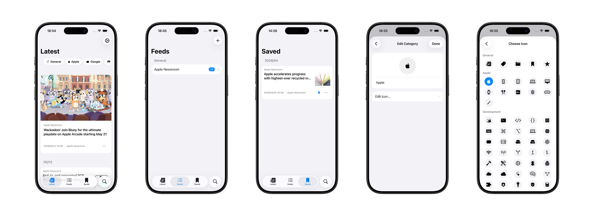

# yomy 📰

yomy is a simple RSS reader for iOS, inspired by Apple News.

The name comes from 読み (*yomi*), Japanese for "reading".

## Features

- Apple News–style article cards with full-bleed images and metadata
- Subscribe to RSS / Atom feeds, organize them by category
- Save articles for later, mark as read, share via the system share sheet
- Home Screen widget showing the latest articles in three sizes
- OPML import / export
- iOS 26 search experience with `Tab(role: .search)`

## Requirements

- Xcode 16.0+
- iOS 17.0+ (some features require iOS 26)

## Links

- [Website](https://shakshi3104.github.io/yomy/)
- [Privacy Policy](https://shakshi3104.github.io/yomy/privacy.html)

## Acknowledgements

Originally forked from [minsc-of-secrets/yomy](https://github.com/minsc-of-secrets/yomy).
